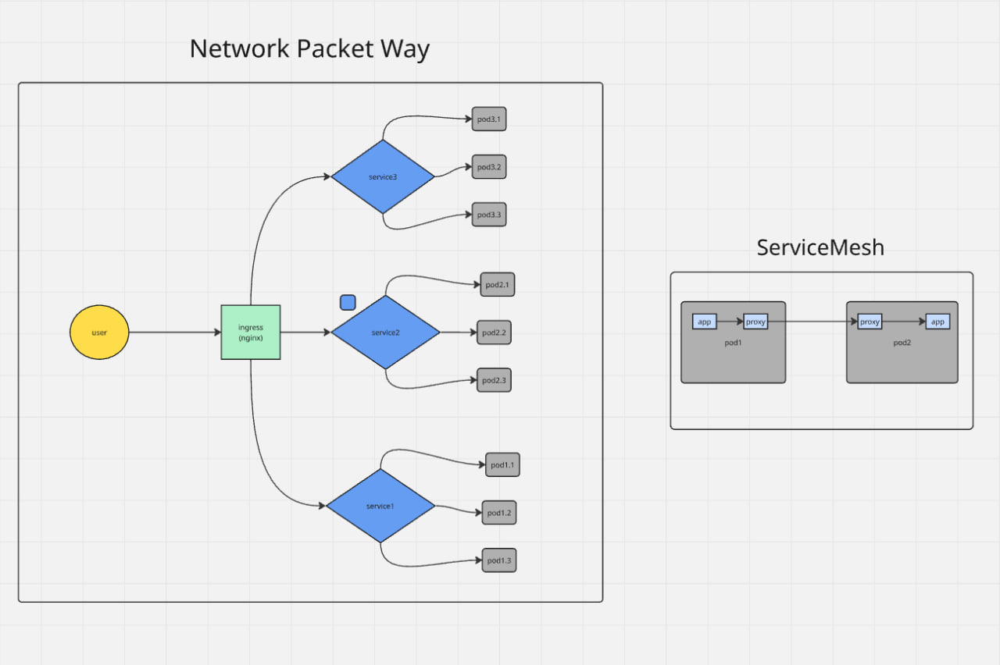

---
tags:
 - kubernetes
 - network
aliases:
 - L4 vs L7 в K8s
---

# 🚀 Путь сетевого пакета в Kubernetes

Как HTTP-запрос от пользователя из интернета доходит до твоего Python-кода внутри Пода.

1. **Пользователь:** Вводит `https://bot.com/api` в браузере.
2. **Ingress (Nginx, L7):** 
 * Принимает запрос из интернета. 
 * Расшифровывает HTTPS. 
 * Читает домен (`bot.com`) и URL (`/api`). 
 * Смотрит в свои правила маршрутизации и понимает: *"Этот трафик нужно отдать Service-Bot"*.
3. **Service (iptables, L4):** 
 * Ingress обращается к Service-Bot.
 * Service работает как внутренний телефонный справочник (Endpoints). Он знает реальные IP-адреса всех живых Подов с этим ботом.
 * Service выбирает один случайный Pod (например, `10.42.1.15`) и делает DNAT (подмену адреса назначения).
4. **CNI (Calico/Flannel, Сеть):** 
 * Ядро Linux понимает, что целевой Pod находится на другом физическом сервере.
 * Сетевой плагин (CNI) упаковывает пакет в туннель и перебрасывает его по физическому кабелю дата-центра на нужный сервер.
5. **Pod (Цель):** 
 * Пакет попадает на целевой сервер и проваливается в изолированную сетевую комнату нужного Пода.
 * Стучится в `targetPort` (например, 8080).
 * Твое приложение получает запрос.

HEAD

